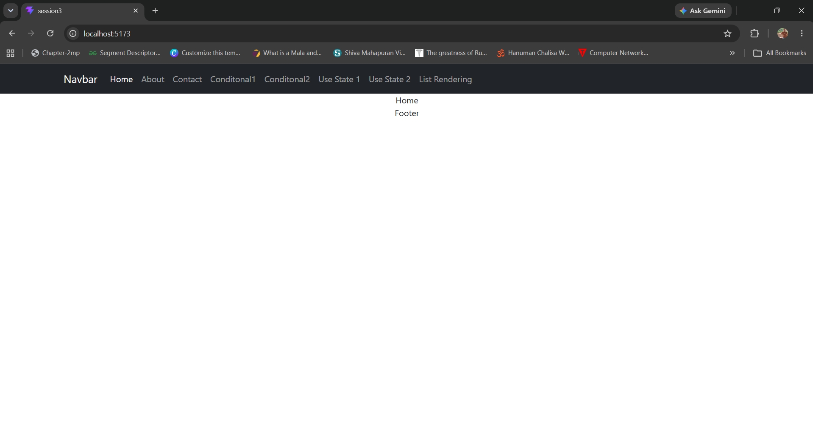
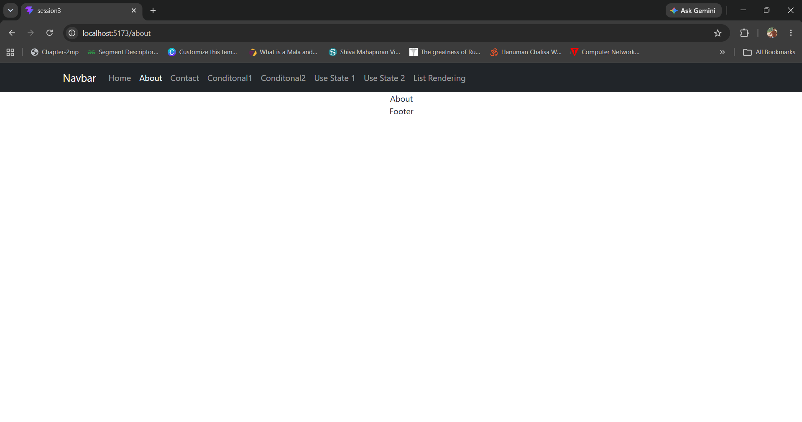
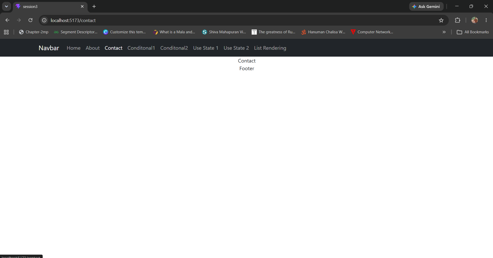
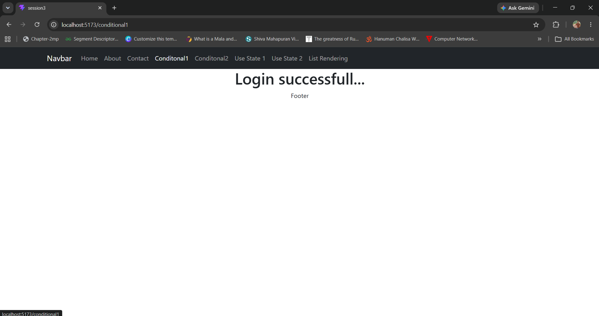
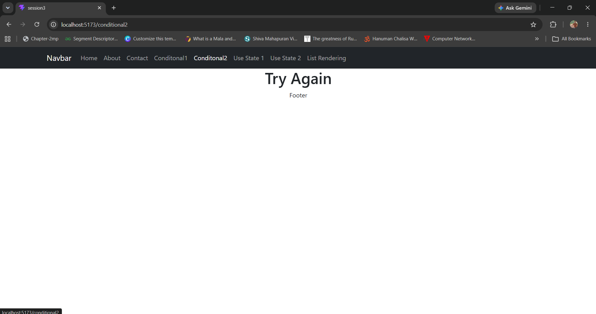
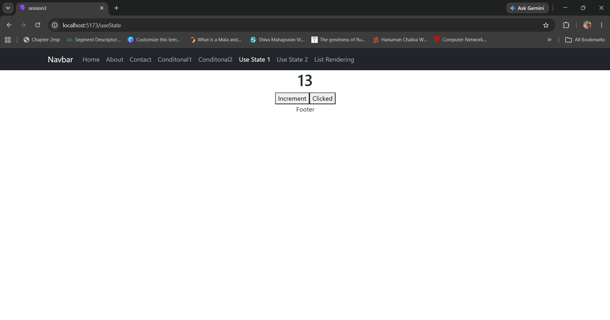
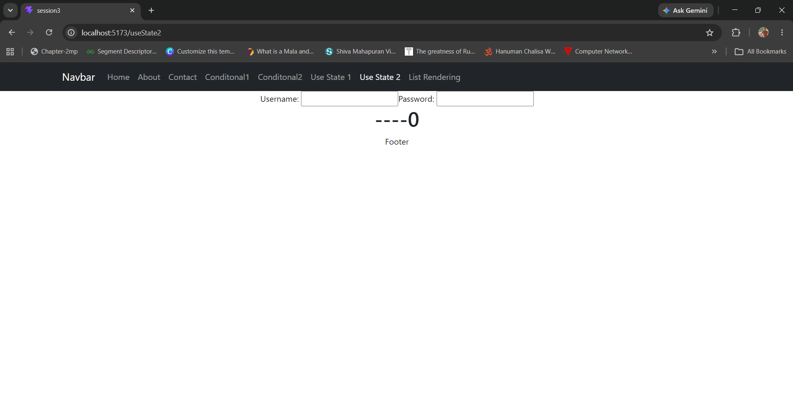
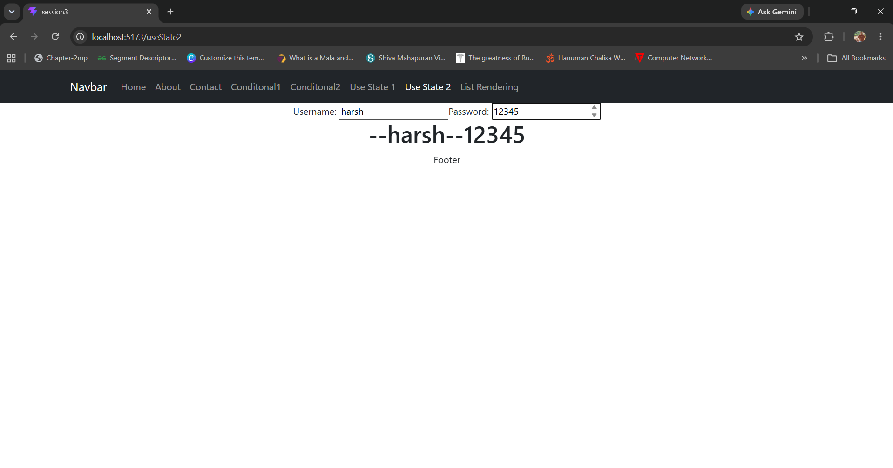
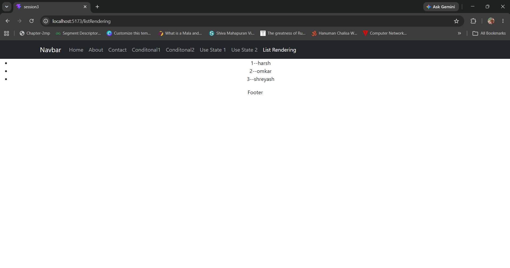

# React Session 3

A React + Vite project demonstrating some of the fundamental concepts of React, including routing, conditional rendering, state management with `useState`, and dynamic list rendering.

---

## 📚 Topics Covered

- React Router DOM
- Navigation Bar
- Home Component
- About Component
- Contact Component
- Conditional Rendering
- React `useState` Hook
- Dynamic List Rendering using `map()`

---

## 🛠️ Technologies Used

- React
- Vite
- React Router DOM
- JavaScript (ES6+)
- HTML5
- CSS3

---

## 📁 Project Structure

```text
session3
│── public
│── src
│   ├── assets
│   ├── components
│   ├── screenshots
│   ├── App.jsx
│   ├── main.jsx
│   └── index.css
│
├── package.json
├── vite.config.js
└── README.md
```

---

# 📸 Project Screenshots

## 🏠 Home Page

The landing page of the application.



---

## ℹ️ About Page

Displays information about the application.



---

## 📞 Contact Page

Displays the contact page.



---

## 🔀 Conditional Rendering - Example 1

Demonstrates rendering different UI elements based on a condition.



---

## 🔀 Conditional Rendering - Example 2

Another example of conditional rendering using React.



---

## ⚛️ useState Example 1 (Before)

Initial state before updating.


---

## ⚛️ useState Example 1 (After)

State after updating with the `useState` hook.



---

## ⚛️ useState Example 2 (Before)

Initial value before state update.



---

## ⚛️ useState Example 2 (After)

Updated value after changing the state.



---

## 📋 Dynamic List Rendering

Demonstrates **dynamic list rendering** in React by iterating over an array of user objects using the `map()` function. Each list item is rendered automatically and assigned a unique `key` for efficient updates.

```jsx
const users = [
  { id: 1, name: "Harsh" },
  { id: 2, name: "Omkar" },
  { id: 3, name: "Shreyash" }
];

users.map((user) => (
  <li key={user.id}>
    {user.id} - {user.name}
  </li>
));
```



---

# 🚀 Getting Started

## Clone the repository

```bash
git clone https://github.com/harshgupta73/MERN_SDAC.git
```

## Navigate to the project

```bash
cd MERN_SDAC/react/session3
```

## Install dependencies

```bash
npm install
```

## Start the development server

```bash
npm run dev
```

Open your browser and visit:

```
http://localhost:5173
```

---

# 🎯 Learning Outcomes

After completing this project, you will understand:

- Creating reusable React components
- Client-side routing with React Router
- Conditional rendering techniques
- Managing component state with `useState`
- Dynamic rendering of lists using `map()`
- Using unique `key` props for efficient rendering
- Organizing a React project with Vite

---

## 👨‍💻 Author

**Harsh Gupta**

GitHub: https://github.com/harshgupta73