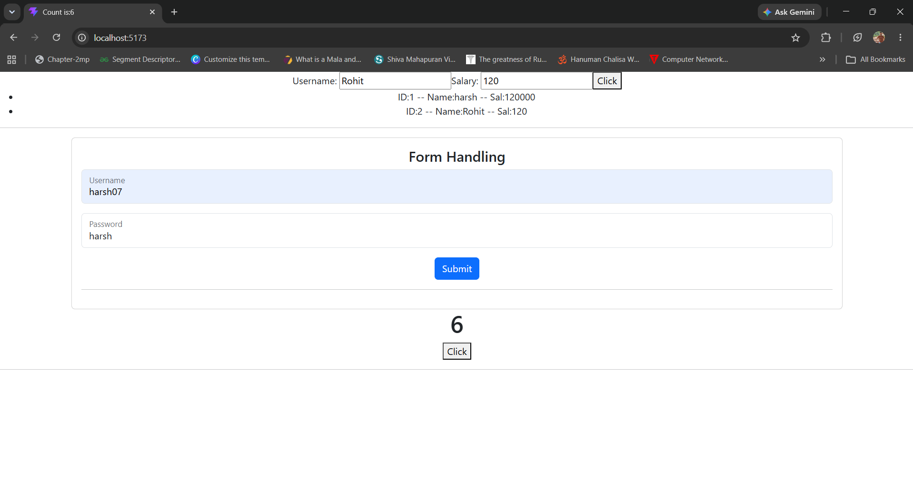
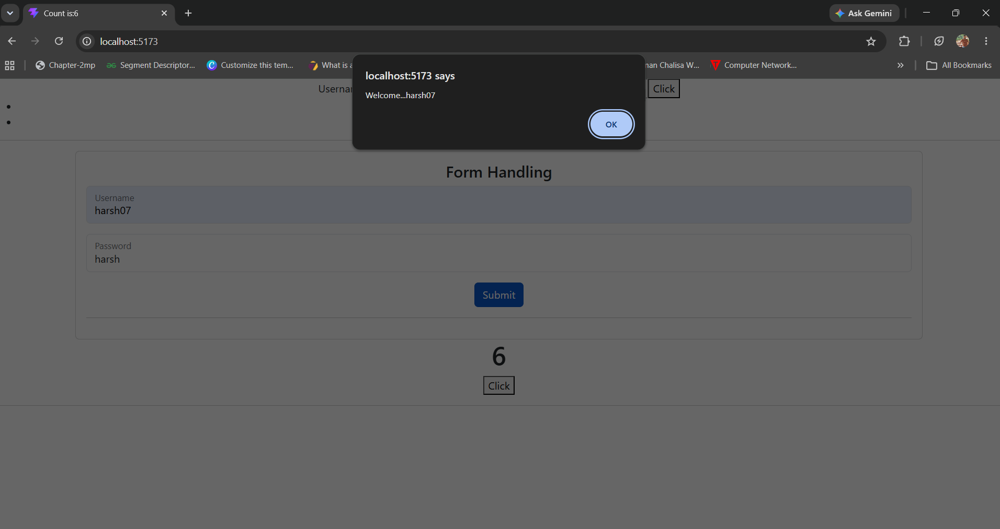

# React Session 3 Practice

This project is built using **React + Vite** to practice important React concepts including state management, form handling, dynamic list rendering, and the `useEffect` hook.

---

# 📚 Concepts Covered

- React Functional Components
- useState Hook
- useEffect Hook
- Controlled Components
- Form Handling
- Dynamic Array Rendering
- Event Handling
- Bootstrap Integration

---

# 🛠 Technologies Used

- React
- Vite
- JavaScript (ES6+)
- Bootstrap 5
- HTML5
- CSS3

---

# 📁 Project Structure

```text
session3_practice
│
├── public
├── src
│   ├── assets
│   ├── components
│   │      ├── FormHandling.jsx
│   │      ├── UseEffect_ex.jsx
│   │      └── UseState_arr.jsx
│   │
│   ├── screenshots
│   │      ├── screenshot1.png
│   │      └── screenshot2.png
│   │
│   ├── App.jsx
│   ├── App.css
│   ├── main.jsx
│   └── index.css
│
├── package.json
├── vite.config.js
└── README.md
```

---

# 📸 Project Screenshots

## 1️⃣ Dynamic Array Rendering using useState

Users can enter an employee's name and salary. On clicking the **Click** button, a new employee object is added to the array and displayed dynamically using the `map()` function.

### Features

- Dynamic array creation
- Rendering list using `map()`
- Unique `key` for every list item



---

## 2️⃣ Form Handling using useState

A simple login form created using controlled components.

### Features

- Username field
- Password field
- Form submission
- Prevents page reload using `preventDefault()`
- Displays a welcome message using `alert()`



---

## 3️⃣ useEffect Hook Example

Demonstrates how the `useEffect` hook performs side effects.

Every time the counter value changes, the browser tab title is updated automatically.

### Example

```
Count is: 6
```

This is achieved using:

```jsx
useEffect(() => {
    document.title = `Count is:${count}`;
});
```


---

# 🚀 Getting Started

## Clone the repository

```bash
git clone https://github.com/harshgupta73/MERN_SDAC.git
```

---

## Navigate to the project

```bash
cd MERN_SDAC/react/session3_practice
```

---

## Install dependencies

```bash
npm install
```

---

## Run the development server

```bash
npm run dev
```

Open your browser and visit:

```
http://localhost:5173
```

---

# 🎯 Learning Outcomes

After completing this project, you will understand:

- Managing state using `useState`
- Creating and updating arrays in React state
- Rendering lists dynamically using `map()`
- Building controlled forms
- Handling form submission events
- Preventing default browser behavior
- Using the `useEffect` hook for side effects
- Updating the browser tab title dynamically
- Integrating Bootstrap with React

---

# 👨‍💻 Author

**Harsh Gupta**

GitHub: https://github.com/harshgupta73