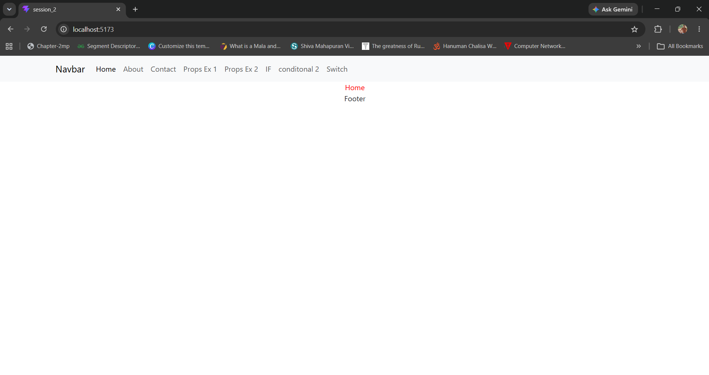
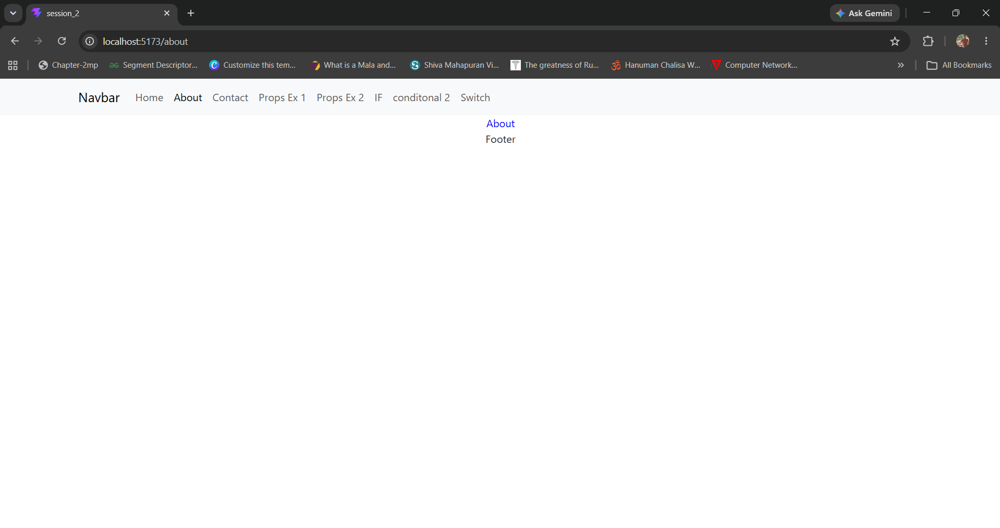
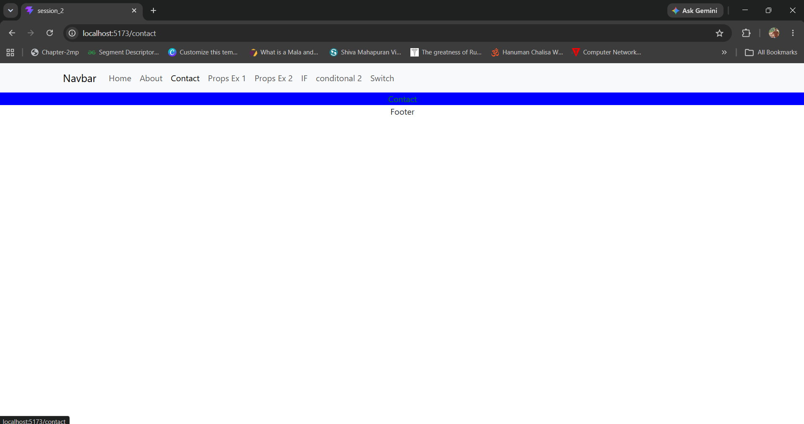
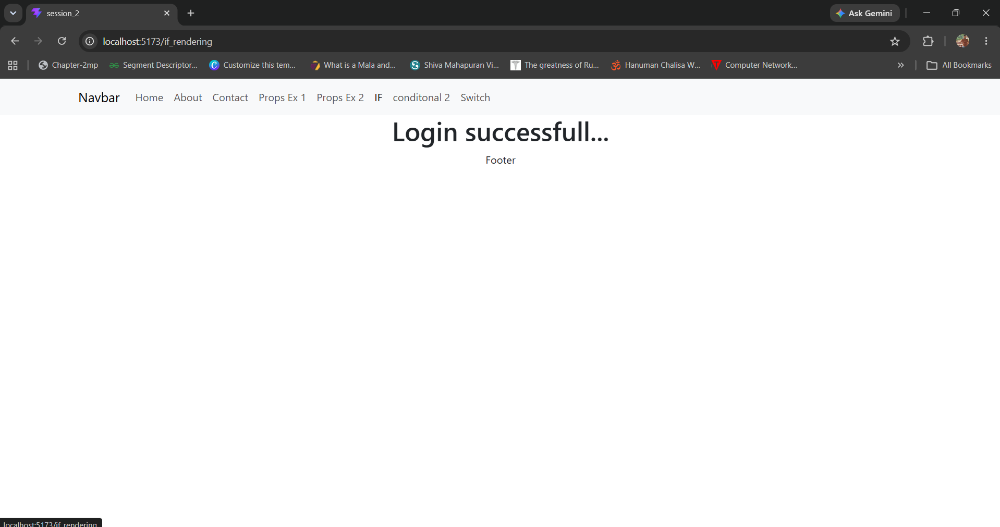
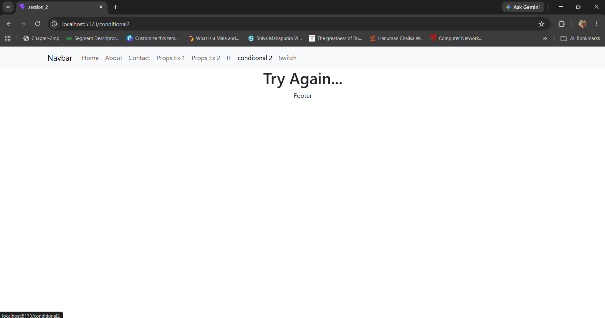
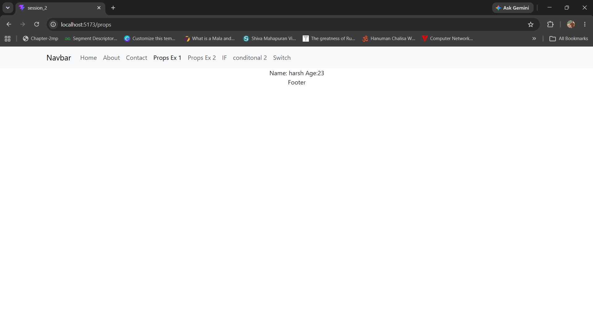
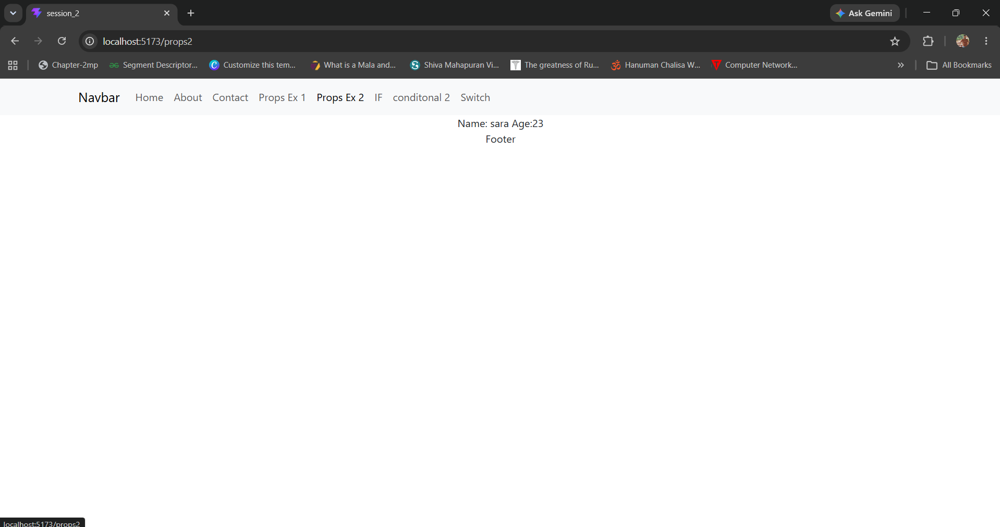
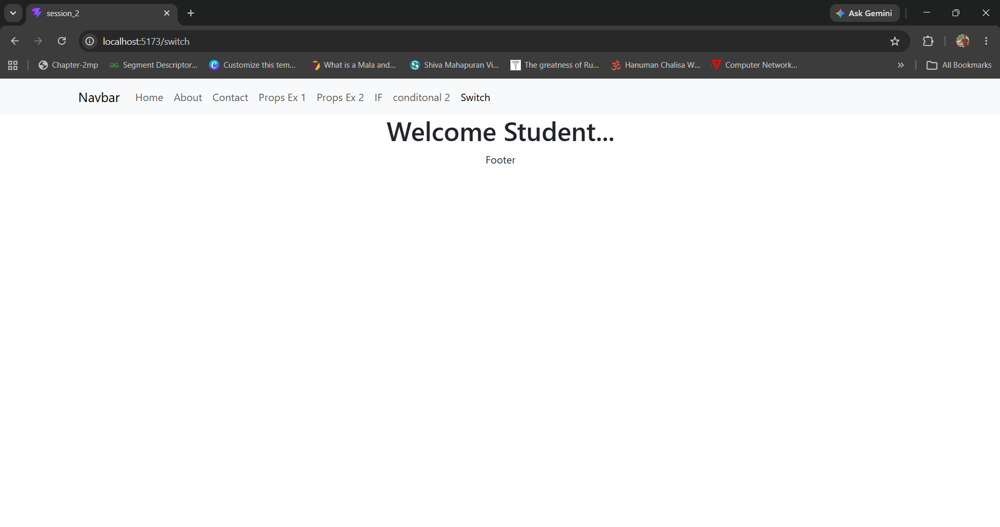

# 🚀 React Conditional Rendering

A React application built with **Vite** to demonstrate different concepts of **Conditional Rendering**, **Props**, and **React Router**. This project includes examples of rendering components based on different conditions, passing data between components using props, and implementing basic page navigation.

---

# 📌 Objective

The primary objective of this project is to understand the core concepts of React by implementing:

* Conditional Rendering using different techniques.
* Passing data through Props.
* Reusable Functional Components.
* Basic Routing with React Router.
* Clean project organization using Vite.

---

## ✨ Features

* Conditional Rendering using `if...else`
* Conditional Rendering using the Ternary (`? :`) Operator
* Conditional Rendering using Logical `&&`
* Switch-based Rendering
* React Props Examples
* Reusable Functional Components
* Simple Multi-page UI (Home, About, Contact)
* React Router Navigation
* Built with React + Vite

---

## 🛠️ Tech Stack

* React
* Vite
* JavaScript (ES6+)
* React Router DOM
* CSS3

---

## 📂 Project Structure

```text
session_2/
├── screenshots/
├── src/
│   ├── assets/
│   ├── components/
│   ├── App.jsx
│   ├── main.jsx
│   └── index.css
├── package.json
├── vite.config.js
└── README.md
```

---

## 📸 Screenshots

### 🏠 Home Page



---

### ℹ️ About Page



---

### 📞 Contact Page



---

### 🔀 Conditional Rendering (if...else)



---

### 🔄 Conditional Rendering Example



---

### 📦 Props Example 1



---

### 📦 Props Example 2



---

### 🔀 Switch Rendering



---

## 🚀 Getting Started

### Clone the repository

```bash
git clone https://github.com/harshgupta73/MERN_SDAC.git
```

### Navigate to the project directory

```bash
cd MERN_SDAC/react/session_2
```

### Install dependencies

```bash
npm install
```

### Start the development server

```bash
npm run dev
```

Open your browser and visit:

```text
http://localhost:5173
```

---

## 📖 Concepts Covered

* React Components
* JSX
* Props
* Conditional Rendering
* `if...else`
* Ternary Operator (`? :`)
* Logical `&&`
* Switch Statement
* React Router
* Component Reusability
* Vite Project Structure

---

## 📚 Learning Outcomes

After completing this project, you will be able to:

* Understand how conditional rendering works in React.
* Pass data between components using Props.
* Build reusable functional components.
* Implement basic routing using React Router.
* Organize a React application using Vite.
* Develop simple and maintainable React applications.

---

## 👨‍💻 Author

**Harsh Gupta**

GitHub: https://github.com/harshgupta73

Repository: https://github.com/harshgupta73/MERN_SDAC/tree/main/react/session_2

---

## ⭐ Support

If you found this project helpful, consider giving the repository a ⭐ on GitHub. Your support is greatly appreciated!
